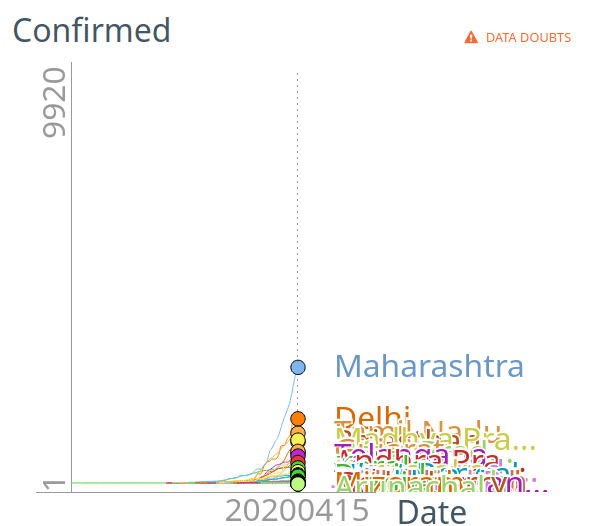
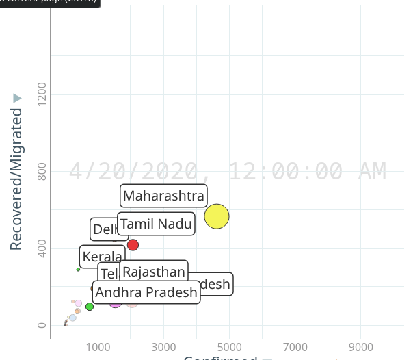

Access the charts from the following links

- [Line Chart](http://randomwalk.in/covid19India/line/) 

- [Bubble Chart](http://randomwalk.in/covid19India/bubble/) 

- [Rank Chart](http://randomwalk.in/covid19India/ranking/) 

*(Last Updated on:  15 Nov 2020)* 

### Few tips on using the charts

- You can interactively select various options available on the right side menu of each chart
- To present the chart in fullscreen use the 'expand' button on bottom right corner
- You can pan and zoom using mouse on bubble chart
- If the data is too cluttered, you can deselect the unwanted plots from the right hand menu
- On Rank Chart click on the 'Confirmed' link on top left corner to select other options to rank

------------------------------------------

## Sneakpeak

- [Line Chart](http://randomwalk.in/covid19India/line/) 

    

- [Bubble Chart](http://randomwalk.in/covid19India/bubble/) 

    

- [Rank Chart](http://randomwalk.in/covid19India/ranking/) 

    

    
------------------------------------------
## Credits

- Analytics by: [Rahul Raj](https://twitter.com/rahulrajpl)
- Data Collection by: [Amey Noolkar](https://github.com/coder-amey)

------------------------------------------

## Feedback

Submit feedback and comments [here](https://github.com/rahulrajpl/covid19India/issues).

Thank you.
